# <center>COA review

<center>04021503 jzx</center>

<center>


</center>
<!--  -->

## 目录

[TOC]

## 第一章 BASIC CONCEPTIONS

- [ ] 已复习
  

<mark><big><strong>  Computer architecture</mark></big></strong>: refers to those attributes that have a direct impact on the logical execution of a program.
>计算机体系结构是指程序员可见的那些属性，换句话说，是直接影响程序执行逻辑的那些属性。


<mark><big><strong>  Computer organization</mark></big></strong>: refers to the operational units and their interconnections that realize the architectural specifications.
>计算机组成是指用于实现体系结构规范的操作单元及其互联。

<mark><big><strong>A hierarchical system</mark></big></strong> is a set of interrelated subsystems，each of the latter， in term，hierarchical in structure until we reach some lowest level of elementary subsystem.
>层次化系统是一组相互关联的子系统，每个子系统在结构上也是层次化的，直到到达基本子系统的最底层。

Function：
* Data processing（数据处理）
* Data storage（数据存储）
* Data movement（数据移动）
* Control（控制）

Structure：
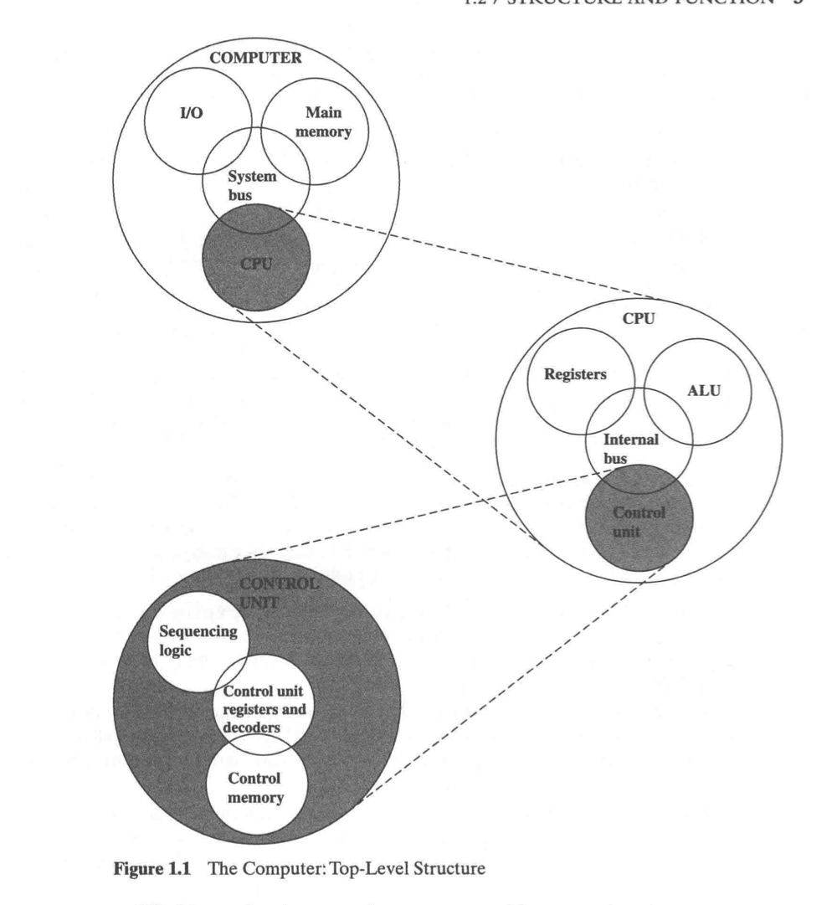


<strong>Interrupt cycle</strong>

* Added to instruction cycle
* If no interrupt: Fetch next instruction
* If interrupt pending:
```
    — Suspend execution of current program and save its context
    — Set PC to start address of interrupt handler routine
    — Process interrupt
    — Restore context and continue interrupted program
```
## 第三章 A Top-level View of Computer Function And Interconnection

- [ ] 已复习
  
指令周期：  


### Locality of reference

Locality of reference:
* Memory reference tends to cluster
* Possible to organize data such that the percentage of accesses to each level is substantially less than the above level:
  ——level 2:all program instructions and data.
  ——level 1:current clusters.

<mark><big>The reasons for using the principle of locality</big><mark>
> a. Program execution is sequential at the most time
> b. A program remains confined to a rather narrow window of procedure-invocation depth
> c. Most iterative constructs consist of a relatively small number of instructions repeated many times
> d. Successive references to these array data structures will be to closely located data items


## 第四章 Cache Memory

- [ ] 已复习
  
### 4.1 access method

* <mark><strong>Sequential access</strong></mark>：Memory is organized into units of data,called records. Access must be made in a specific linear sequence. Stored addressing information is used to separate records and assist in the retrieval process.<strong>must be moved from its current location to the desired location, passing and rejecting each intermediate record.</strong>
* <mark><strong>Direct access</strong></mark>:<strong>Access is accomplished by direct access to reach a general vicinity plus sequential searching,counting ,or waiting to reach the final location</strong>
* <mark><strong>Random access</strong></mark>:<strong>the time to access a given location is independent of the sequence of prior accesses and is constant.Thus any location can be selected at random and directly addressed and accessed</strong>
*  <mark><strong>Associative</strong></mark>:<strong>Data is located by a comparison with contents of a portion of the store,Access time is independent of location or previous access</strong>

### 4.2 memory Hierarchy

>Capacity= WordSize * Number Of Words

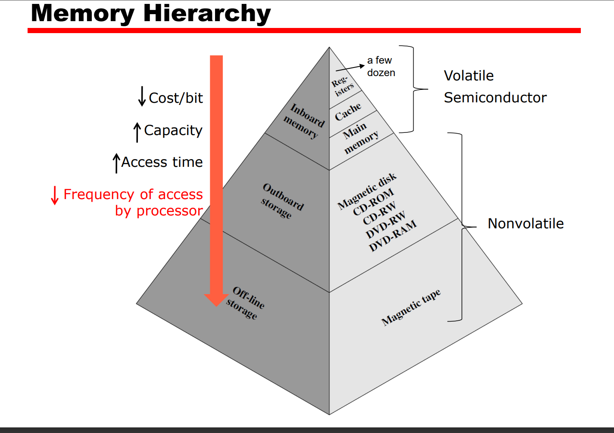

* Faster access time,greater cost per bit
* Greater capacity,smaller cost per bit
* Greater capacity,slower access time
  
寻址时间期望：
>T=T1 * H + (T1+T2)*H
>H:cache命中概率，T1：cache访问时间 T2:Memory访问时间

### cache read operation:
1. CPU requests contents of memory location
2. Check cache for this data
3. If present,get from cache(cache hit)
4. If not present, access main memory for required block(cache miss)
5. allocate cache line
6. load required $\color{red}{block}$ to cache
7. Then deliver from cache to CPU

### 4.3 Mapping Function

> the capacity of a line in cache is as same as a block of the Memory
>• Cache lines < main memory blocks

```
• Main memory
        —2n addressable words
        —Unique n bit address
        —Consists of M blocks (K words each)
• Cache
        —Consists of C lines
        —Each line = K words + Tag + Control bits (not shown)
        —C<<M
        —Tag identifies stored block
``` 
```
Cache Read Operation – overview:
    • CPU requests contents of memory location
    • Check cache for this data
    • If present, get from cache (fast)
    • If not present, access main memory for required block
    • Allocate cache line 
    • Load required block to cache
    • Then deliver from cache to CPU
```

#### Direct Mapping function

Each block of main memory maps to only one cache line
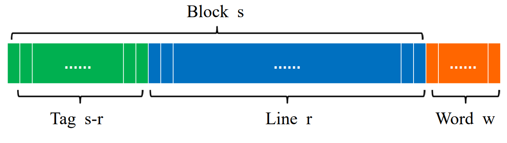
• One Block = $2^w$ bytes( or words)
```
• Least significant w bits identify a unique word
• Remaining s bits specify one memory block
• Line field identify one of the m=2r lines of the cache
• s = r (cache line field) + s-r (tag)
```


#### Associative Mapping function


```
• A block can be loaded into any line
• Memory address = tag + word
• Tag uniquely identifies block of memory
• Every line’s tag is examined for a match
• Cache searching gets expensive
```
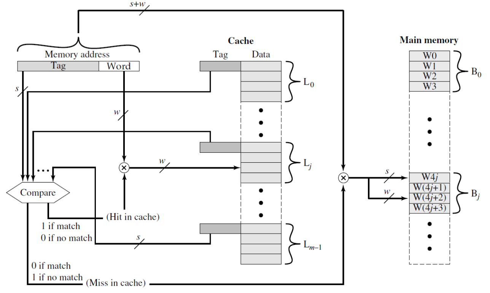

#### Set Associative Mapping function

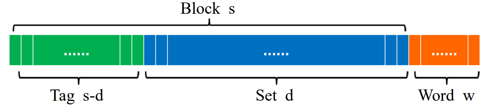
```
• Cache is divided into v sets (v =2d)
• k lines/set (k-way set associative mapping)
• A given block maps to any line in a given set
```
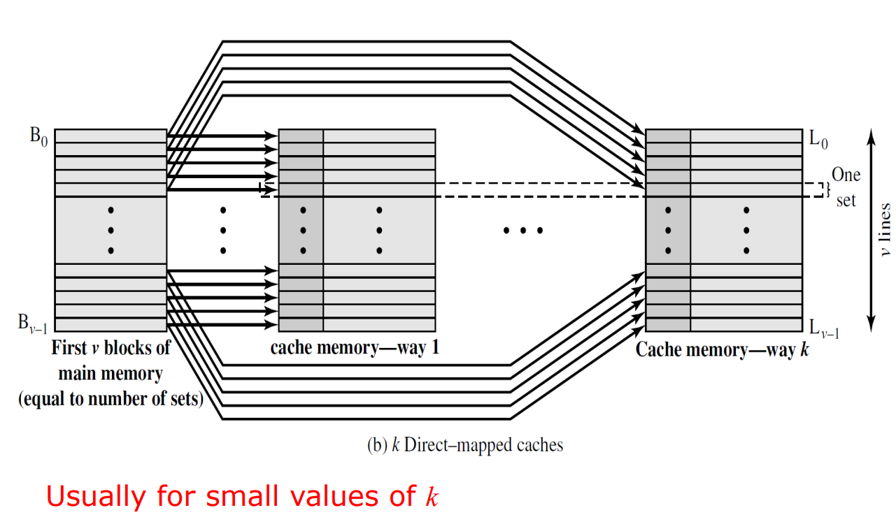


<big>the relationship among the three mapping function</big>:

set associative mapping is general and include the other two mappinng methods,if the set size is a line, it is direct mapping, and if a set include all the lines of the cache,it is associative mapping
> 即组关联中高速缓存中的块映射到唯一的组内，然后在组内和全相联一样随机映射，所以当组的大小为1行时，等于直接映射，当组的大小等于高速缓存大小时，等于全相联映射

### Replacement Algrithm

Direct mapping
```
• No choice
• Each block only maps to one line
• Replace that line
```
Associative & Set Associative
```
• Least recently used (LRU)
    —In cache longest with no reference
    —e.g. in 2 way set associative, each line includes 
    a USE bit; for fully associative cache, maintain a 
    list of line index, move the referenced line to 
    the front, replace the back of the list
• First in first out (FIFO)
    —In cache longest
• Least frequently used (LFU)
    —Has fewest hits
• Random
    —Slightly inferior to usage based algorithms
```

### Write Policy
<big>write through</big>
```
• All writes go to main memory as well as 
cache
• CPU can monitor main memory traffic to 
keep cache up to date
• Disadvantages
    —Lots of traffic
    —Slows down writes
```
<big>write back</big>
```
• Updates initially made in cache only
• Update occurs  Set dirty bit, or use bit
• I/O access main memory through cache
• May cause potential bottleneck
```

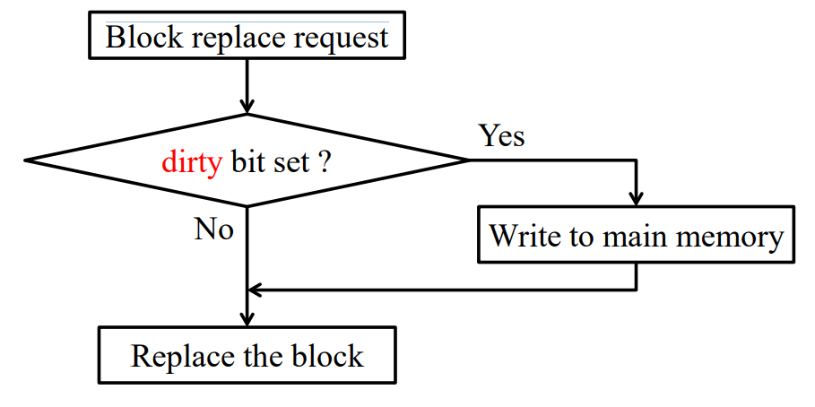

## 第十二章 Instruction Sets: Characteristics And Functions

- [ ] 已复习

### Elements of an instruction
The elements of a machine instruction:
```
• Operation code (Op code)
    —Operations to be performed (binary code)
    —Do this
• Source operand reference
    —Operands that are inputs for the operation
    —To this
• Result operand reference
    —Put the answer here
• Next instruction reference
    —Where to fetch the next instruction
    —When you have done that, do this..
``` 
Instruction types：
```
• Data processing : Arithmetic and logic instructions
• Data storage : Movement of data into or out of register and or memory locations
• Data movement : I/O instructions 
• Control : Test and branch instructions
```

Number of Addresses：
* 4 addresses：
>2 source operands + 1 destination operand + next instruction
* 3 addresses:
>Next instruction reference is implicit
>Operand 1, Operand 2, Result
>Not common,Needs relatively long words to hold everything
* 2 addresses:
>One address doubles as operand and result
* 1 addresses:
>Implicit second address
>Usually a register (accumulator)
* 0 addresses:
>All addresses implicit
>Uses a stack

<mark><strong>three places for storing</mark></strong>:

* Register
* Start of called procedure
* Top of stack
  
general categories of data：
```
• Address（地址）
• Numbers（数字）
• Characters（字符）
• Logic data（逻辑数据）
```

### procedure call


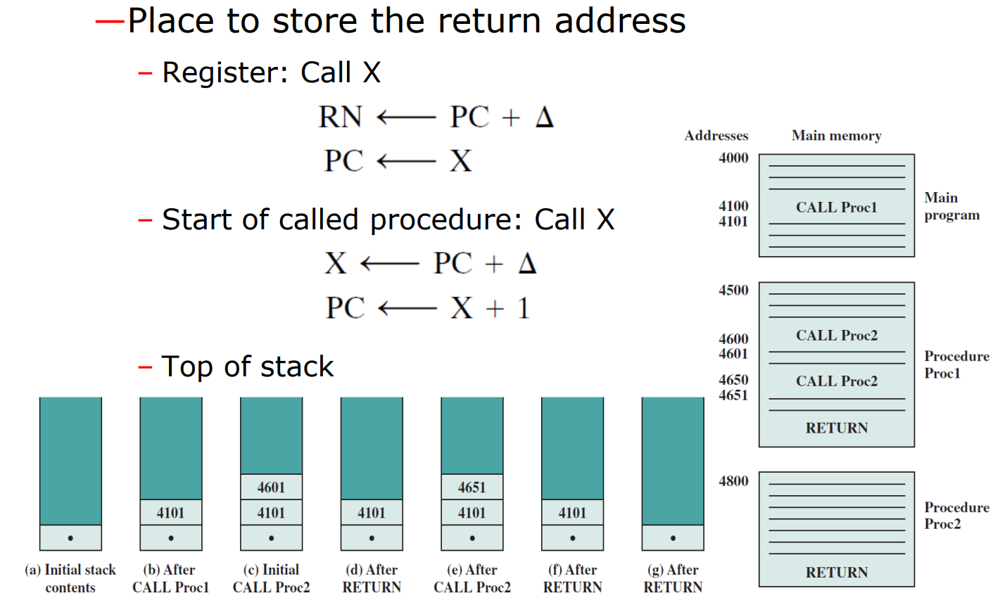

### 12.2 Expression explanation
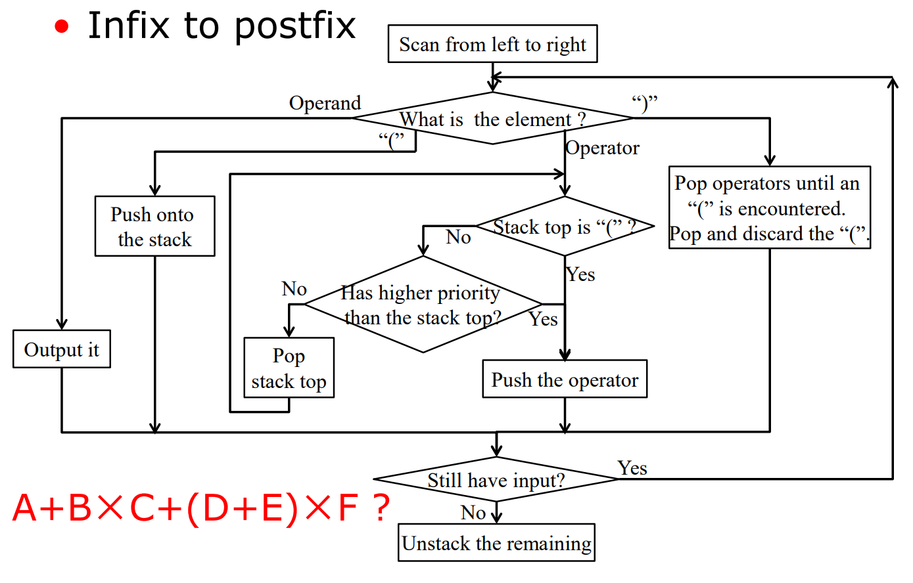
has higher priority than the stack top then push the operator ,otherwise,pop stack pop

## 第十三章 Instruction Sets: Addressing Modes And Formats 

Instruction Formats:
* layout of bits in an instruction
* includes opcode
* includes(implicit or explicit) operands
* indicates addressing mode for operand
* usually more than one instruction format in an instruction set

- [ ] 已复习

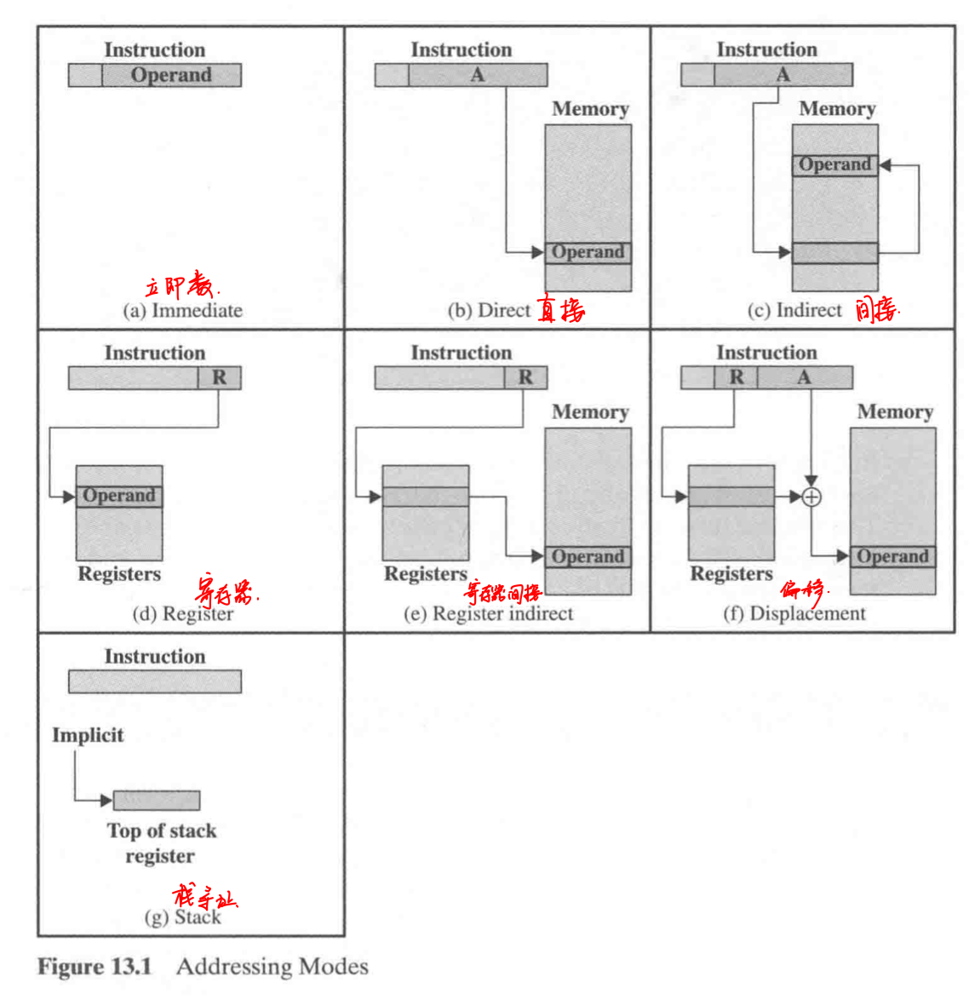
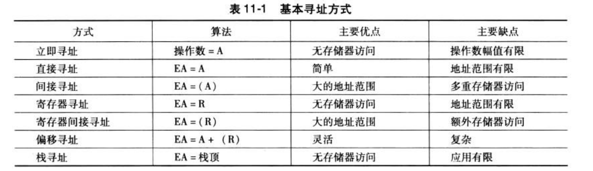

### Displacement Addressing
three of the most common uses of displacement addressing:
1. Relative addressing:
EA = (PC) + I +Displacement
>地址等于当前指令pc指令计数寄存器的地址加上一条指令长度（即下一条指令的地址）再加上地址偏移
2. Base-register addressing:
   ```
   • A holds displacement
   • R holds pointer to base address (main memory address)
   • R may be explicit or implicit
   ```

3. Indexing(also called autoindexing):
   ```
    • A = base
    • R = displacement
    • EA = A + (R)
    • Good for accessing arrays and iterative task
        —Autoindexing
        —EA = A + (R)
        —(R) <—— (R) + 1
    ```   
* Conbine indirect and displacement
1. postindexing：
   >—Indexing performed after indirection
   >即偏移在间接寻址之后
   >—EA = (A) + (R)
2. preindexing：
   >—Indexing performed before indirection
   >即偏移在间接寻址之前
   >—EA = (A+(R))

### Instruction length:
* most basic design issue
* affected by and affects:
  ```
  memory size
  memory organization
  bus structure
  cpu complexity
  cpu speed
  ```
* determines the computer's richness and flexibility

  
## 第十四章 Processor Structure And Function

- [ ] 已复习

<strong>Register organization</strong>:
Two categories:

1. User-visible registers:Minimize main memory references by optimizing use of registers:
 * general purpose
 * data
 * address
 * condition codes

2. Control and status registers:control the operations of the processor and the execution of programs:
* PC,IR,MAR,MBR
* Program status word(PSW)

The  PSW typically contains codes plus other status imformation ，include：Sign，Zero，Carry，Equal，Overflow，Interrupt enable/disable，supervisor

### 14.4 instruction processing

<mark>Two Stage insstruction pipeline</mark>:
Fetch  and  Execute
<strong>why does two stages not double the execution speed</strong>:
```
1. Execution time longer than fetch time
2. Conditional branch makes next instruction address unknown.
```


1. <mark><strong>Fetch instruction(FI)</mark></strong>:Read the next expected instruction into a buffer
2. <mark><strong>Decode instruction(DI)</mark></strong>:Determine the opcode and the operand specifiers.
3. <mark><strong>Calculate operation(CO)</mark></strong>:Calculate the effective address of each source operand,This may involve displacement,register indirect,indirect,or other forms of address calculation.
4. <mark><strong>Fetch operands(FO)</mark></strong>:Fetch each operand from memory. Operands in registers need not be fetched
5. <mark><strong>Execute instruction(EI)</mark></strong>:Perform the indicated operation and store the result,if any, in the specified destination operand location
6. <mark><strong>Write operand(WO)</mark></strong>:Store the result in memory.
   
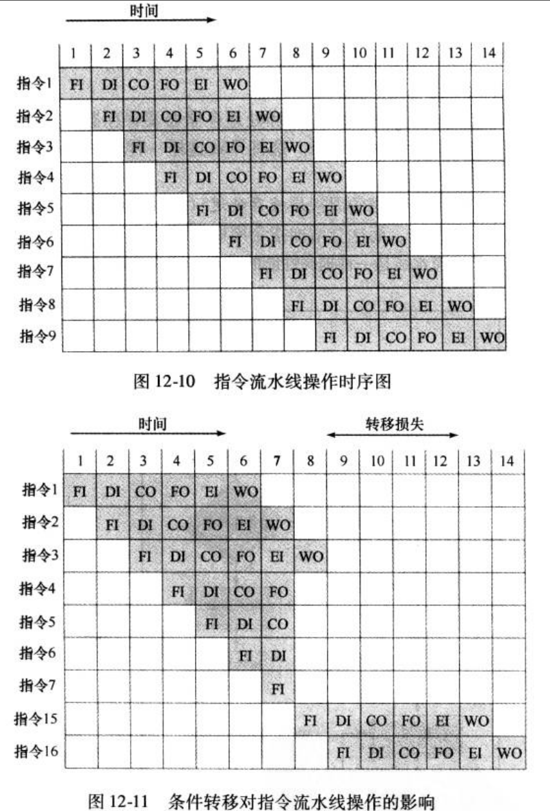
>可以看到当branch指令到了EI执行阶段会清空流水线也就是让发生跳转后错误执行的顺序指令清空

<mark>指令流水线的加速比因子（The speedup factor） </mark>   
Sk = $T1,n \over T k,n$ = $nk \over k+(n+1)$
the limit of the Sk is <mark> K </mark>

three types of data hazards:
* Read after write(RAW) —— true data dependencty
* Write after read(WAR) —— antidependency
* Write after write(WAW) —— output dependency

### Dealing with Branches
* Multiple streams（多流）
* Prefetch branch target(预取分支目标)
* Loop buffer（循环缓存）
* Branch prediction (分支预测):
   ```
    • Predict never taken
    • Predict always taken
    • Predict by opcode
    • Taken/not taken switch
    • Branch history table
  ```
* Delayed branch(延迟分支)

for one bit predict switch,when execute a loop,it will cause two errors total(the enter and the exit)
>对于单比特的分支预测，执行循环代码到循环结束一共会出现两次预测错误（进入循环时和离开循环时）
  
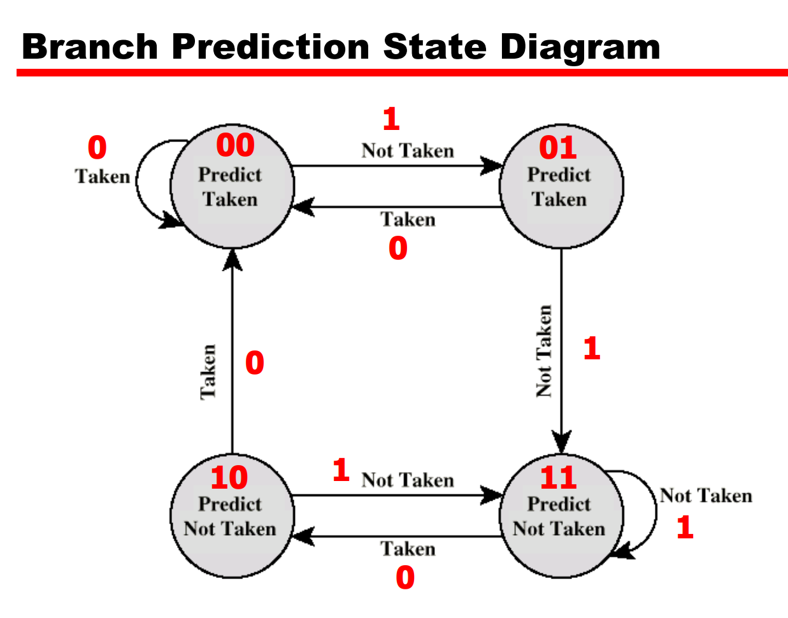

## 第十五章 Reduced instruction set computers (RISC)

- [ ] 已复习
RISC (Reduced instruction set computers 简单指令集计算机)
CISC（complex instruction set computer 复杂指令集计算机）
<strong>RISC Key features</strong>:

* Large number of general purpose registers and/Or use of compiler technology to optimize register use
* Limited and simple instruction set
* Emphasis on optimizing instruction pipeline

Charasteristics of Reduced Instructions Set Architecture:
* One instruction per cycle
* Register-to-register operations
* Simple addressing modes
* Simple instruction formats

### 15.1 register window
The window is divided into three fixed-size areas:


<mark><strong>Parameter registers</strong></mark> hold parameters passed down from the procedure that called the current procedure and hold results to be passed back up.

<mark><strong>Local registers</mark></strong> are used for local variables, as assigned by the compiler. 

<mark><strong>Temporary registers</strong></mark> are used to exchange parameters and results with the next lower level(procedure called by current procedure).The temporary registers at one level are physically the same as the parameter registers at the next lower level.
>参数寄存器用来保存调用当前过程的过程（即父过程）向下传递的参数和将被返回的结果。
>局部寄存器用于局部变量，这由编译器指派。
>临时寄存器用于当前过程与下一过程（被当前过程调用的过程，即子过程）交换参数的结果。

<mark><big>The temporary registers at one level are physically the same as the parameter registers at the next lower level.</big><mark>
> 某一级的临时寄存器与下一级的参数寄存器是物理同一的，这种重叠允许不用实际移动数据就能传递参数。
> 两个不同级的寄存器窗口在物理上是完全不同的。也就是说，第J级的参数和局部寄存器与第J+1的局部寄存器和临时寄存器是不相交的。

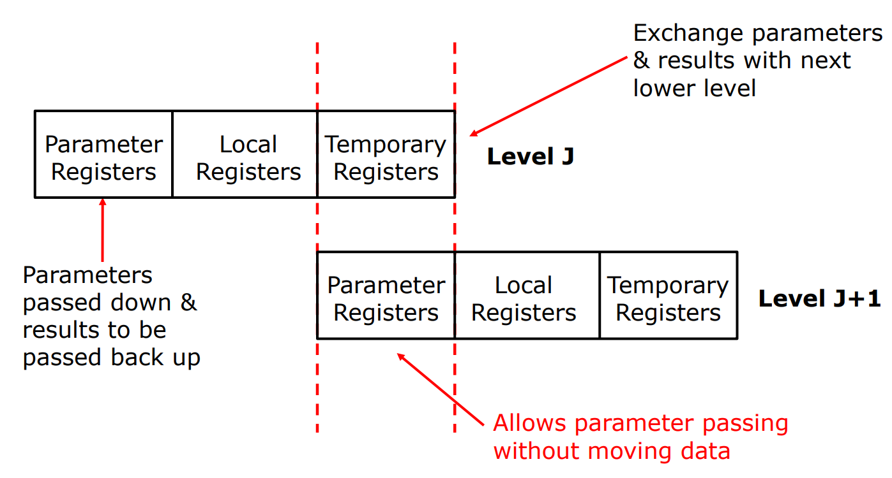

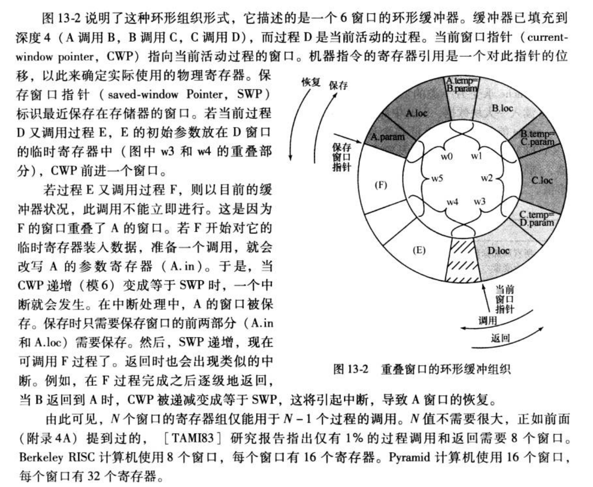


• Nodes are symbolic registers
• Edges depict overlap in program fragment
• Try to color the graph with n colors
```
—n is the number of real registers
—Adjacent nodes have different colors
```
• Nodes that can not be colored are placed in
memory

### SPARC

(scalable processor architecture,可扩展处理器体系结构)


<big><strong>
A SPARC implementation has K register windows. What is the number N of physical registers?
N=8+16k
</big><strong>

---


---

### 15.3 RISC PIPELINING

Most instructions are register to register, and an instruction cycle has the following two stages:
I: Instruction fetch.
E: Execute. Performs an ALU operation with register input and output.

---
For load and store operations, three stages are required:
I: Instruction fetch.
E: Execute. Calculates memory address.
D: Memory. Register-to-memory or memory-to-register operation. 


Data and branch dependencies reduce the over all execution rate   

Solution: 
• Code reorganization
• Delayed branch:<mark>The branch does not take effect until after execution of following instruction</mark>
```
  —This following instruction is the delay slot 
```
#### delayed branch


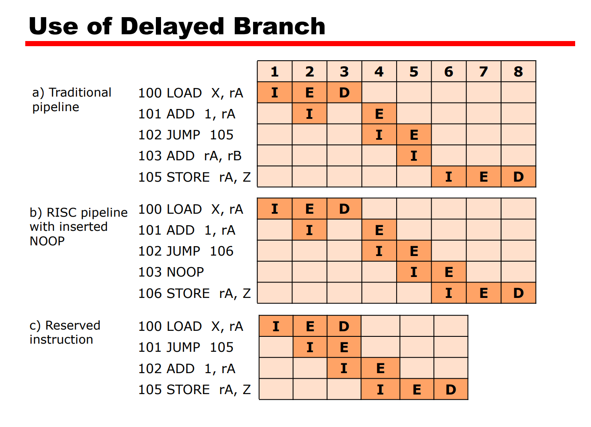

• Interchange of instructions works successfully for unconditional 
branches, calls, and returns
• Be careful for conditional branches

#### delayed load


#### loop unrolling 
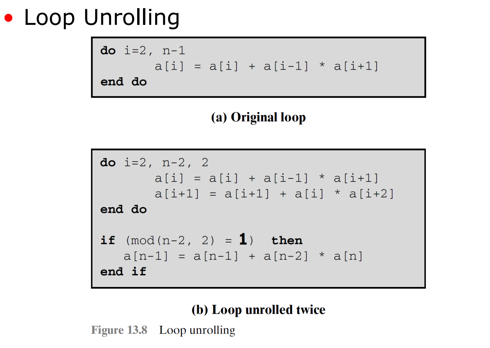


## 第十六章 Instruction-Level Parallesim And Superscalar Process

- [ ] 已复习

<mark>superscalar</mark>  is common instructions can be initiated simultaneously and executed independently. 
<mark>superpipeline</mark> is capable of performing two pipeline stages per clock cycle.

### 16.1 Constraints

<mark><strong>Instruction-level parallelism</strong></mark> refers to the degree to which, on average,the instructions of a program can be executed in parallel.
> 指令集并行性指的是程序指令能并行执行的程度。

5 constraints：
1. <strong>(True data dependency)真实数据相关性</strong>:RAW(Read after Write) or Flow dependency
2. <strong>(procedual dependency)过程相关性</strong>:The instructions following a branch (taken or not taken) have a procedural dependency on the branch and cannot be executed until the branch is executed.
3. <strong>(resauce dependency)资源冲突</strong>:a competition of two or more instructions for the same resource at the same time.
4. <strong>(output dependency)输出相关性</strong>：WAW(write after write)
5. <strong>(antidependency)反相关性</strong>:WAR(Write after Read)

### 16.2 Design Issues
<strong>Instruction-level parallelism</strong> exists when instructions in a sequence are dependent and thus can be executed in parallel by overlapping.
> 指令并行性存在于 指令序列中的指令是独立的，并因此能通过重叠来并行执行时。

<mark>The degree of instruction-level parallelism is determined by the frequency of true data dependencies and procedural dependencies in the code，and operation latency</mark> ，and these factors are dependent on the instruction set architecture and on the application.
> 代码中的真实数据相关性和过程相关性的频繁程度决定了指令级的并行性。这些因素本身又取决于指令集体系和应用程序。 

<mark><strong>Machine parallelism</strong> is a machine of the ability of the processor to take advantage of instruction-level parallelism</mark> 
Machine parallelism is determined by the number of instructions that can be fetched and executed at the same time(the number of parallel pipelines) and by the speed and sophistication of the mechanisms that the processor uses to find independent instructions.
> 机器并行性是指处理器获取指令级并行性好处的能力程度。机器并行性由下面这些因素决定，它能同时取指和执行的指令数（并行流水线数），以及处理器用于找出独立指令所使用结构的速度及精巧程度。


<strong>instruction issue</strong> refer the process of initiating instruction execution in the processor's functional units and the term instruction.
> 指令发射是指启动指令去处理器功能单元执行的过程

<strong>instruction-issue policy</strong> refer the protocol used to issue instructions.
> 指令发射策略指启动指令执行时所采用的协议

* in-order issue with in-order completion
* in-order issue with out-of-order completion
* out-of-order issue with out-of-order completion

for example:

```
              I1 requires two cycles to execute
              I3 and I4 conflict for the same functional unit
              I5 depends on the value produced by I4
              I5 and I6 conflct for a functional unit
```
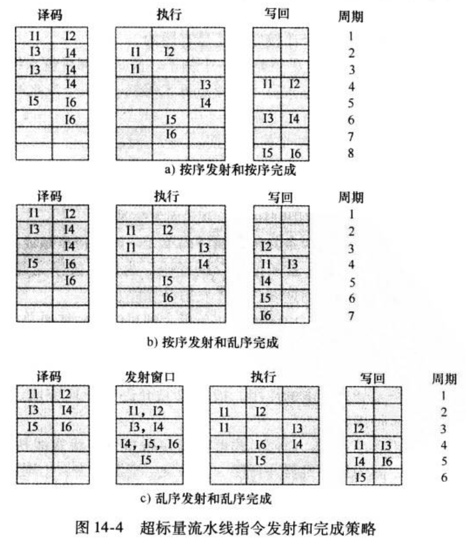

<big>the purpose of an instruction window</big>:
<mark>to decouple the decode and execute stages of the pipeline to allow out-of-order issue</mark> 

> For an out of order issue policy,the instruction window is a buffer that holds decoded instructions. These may be issued from the instruction window in the most convenient order

Out-of-Order Issue Out-of-Order Completion
```
• Decouple decode pipeline from execution pipeline
• Instruction window (a buffer) is used 
• Can continue to fetch and decode until this buffer is full
• Since instructions have been decoded, processor can look ahead
• When a functional unit is available, an instruction(no conflict or dependency) can be execute
```
### 16.3 Register Renaming
one method for traditional resource-conflict solution:duplication of resources
<mark>register renaming</mark> : register are allocated dynamically by the processor hardware, and they are associated with the values needed by instructions at various points in time.
for example:
```
                  I1 : R3b <—— R3a op R5a
                  I3 : R4b <—— R3b + 1
                  I5 : R3c <—— R5a + 1
                  I5 ：R7a <—— R3c op R4b
```
Register renaming is used to fix the WAR and WAW.(output dependency and antidependency)

### 16.4 Superscalar Execution
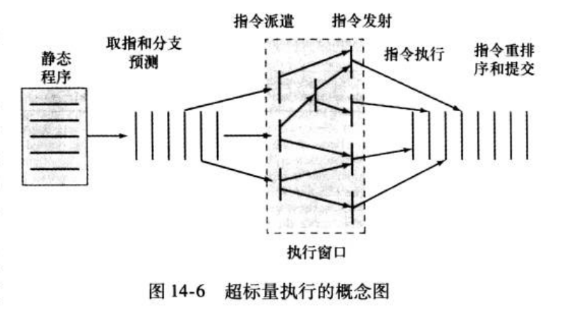
The final step mentioned in the preceding paragraph is referred to as <strong>committing</strong> or <strong> retiring </strong>

<mark>reasons for committing</mark> : the use of parallel,multiple pipelines,instructions may complete in an order different from that shown in the static program. Further ,the use of branch prediction and speculative execution means that some instructions may complete execution and then must be abandoned because the branch they present is not taken.
> superscalar uses more the branch prediction ，the simple processor uses the static prediction technique ， more sophisticated processors use dynamic branch prediction based on branch history analysis
> 随着超标量的开发，更多采用分支预测技术。

## 第二十章 Control Unit Operation

- [ ] 已复习


<mark><strong>Memory address register（MAR）</strong></mark>: Is connected to the address lines of the system bus. It specifies the address in memory for a read or write operation.

<mark><strong>Buffer address register（MBR）</strong></mark>:Is connected to the data lines of the system bus. It contains the value to be stored in memory or the last value read from memory.

<mark><strong>Program counter（PC）</strong></mark>:Holds the address of the next instruction to be fetched.

<mark><strong>Instruction register（IR）</strong></mark>:Holds the last instruction fetched.

### 20.1 Mirco-operations

THE fetch cycle:

```masm
              t1: MAR <—— (PC)
              t2: MBR <—— Memory
                  PC  <—— (PC) + I
              t3：IR  <—— (MBR) 
```

THE Indirect Cycle:

```masm
              t1: MAR <—— (IR(Address))
              t2: MBR <—— Memory
              t3：IR(Address)  <—— (MBR(Address))     
```

THE Interrupt Cycle:

```masm
              t1: MAR <—— (PC)
              t2: MBR <—— Save_Address
                  PC  <—— Routine_Address
              t3：Memorary  <—— (MBR)     
```

THE Execute Cycle:

    ADD R1,X:

    ```masm
                  t1: MAR <—— (IR(Address))
                  t2: MBR <—— Memory
                  t3：R1  <—— (R1) + (MBR)     
    ```


    ISZ X:

    ```masm
                  t1: MAR <—— (IR(Address))
                  t2: MBR <—— Memory
                  t2: MBR <—— (MBR) + 1
                  t3：Memorary  <—— (MBR)
                      If ((MBR) = 0) then (PC <—— (PC) + I)  
    ```

    BSA X:

    ```masm
                  t1: MAR <—— (IR(Address))
                      MBR <—— (PC)
                  t2: PC  <—— (IR(address))
                      Memory <—— （MBR）
                  t3：Memorary  <—— (MBR)
                      PC  <—— (PC) + I
    ```

<center><mark><big>The instruction cycle</mark></big>

</center>

### control of the processor


Basic functional elements of the processor(处理器的基本功能元件)
1. ALU
2. Registers
3. Internal data paths 内部数据通路
4. External data paths 外部数据通路
5. Control unit

the micro-operations categories:
* Transfer data from one register to another.
* Transfer data from a register to an external interface(e.g. system bus)
* Transfer data from an external interface to a register
* Perform an arithmetic or logic operation, using registers for input and output.

The control unit performs two basic tasks:
* <big>Sequencing(排序)</big>:The control unit causes the processor to step through a series of micro-operations in the proper sequence,based on the program being executed.
* <big>Execution（执行）</big>:The control unit causes each micro-operation to be performed.

### <big>Control Signals:</big>
---
Three types of control signals(三种控制信号)
1. Activate an ALU function(激活ALU的功能)
2. Activate a data path(激活数据通路)
3. Signals on the external system bus or other external interface(通过系统总线或者其他外部接口传递来的信号)

Control Unit inputs:
* <strong>Clock</strong>:The control unit causes one micro-operation to be performed during the execute cycle.
  
* <strong>Instruction register</strong>:The opcode and addressing mode of the current instruction are to determine which micro-operations to perform during the execute cycle.
 
* <strong>Flags</strong>:These are needed by the control unit to determine the status of the processor and the outcome of the previous ALU operations. 
  
* <strong>Control signals from control bus</strong>:These are two types:those that cause data to be moved from one register to another, and those that activate specific ALU functions.
  
* <strong>Control signals within the processor</strong>:The control bus portion of the system bus provides signals to the control unit.
  
* <strong>Control signals to control bus</strong>:These are also of two types: control signals to memory,and control signals to the I/O modules.

  翻译：
<!--  -->


Output(输出):
1. <mark>Control signals within the processor</mark>: These are two types: those that cause data to be moved from one register to another, and those that activate specific ALU functions(处理器内的控制信号：这有两种类型：一种是导致数据从一个寄存器移动到另一个寄存器的信号，另一种是激活特定ALU功能的信号)
2. <mark>Control signals to control bus</mark>: These are also of two types: control signals to memory, and control signals to the I/O modules(控制总线的控制信号：这些信号也有两种类型：存储器的控制信号和I/O模块的控制信号)


Control Unit Implementation 控制单元的实现:
1. Two categories:(两种类型)
* Hardwired implementation(硬连线实现)
* Microprogrammed implementation(微编程实现)
```
In a hardwired implementation, the control unit is essentially a state machine circuit(在硬接线实现中，控制单元本质上是一个状态机电路)
Its input logic signals are transformed into a set of output logic signals, which are the control signals(它的输入逻辑信号被转换成一组输出逻辑信号，即控制信号)
控制信号为1或者0，进行处理，不能够直接拿过来使用
```

  
<center>常见的微操作对应控制信号:</center>

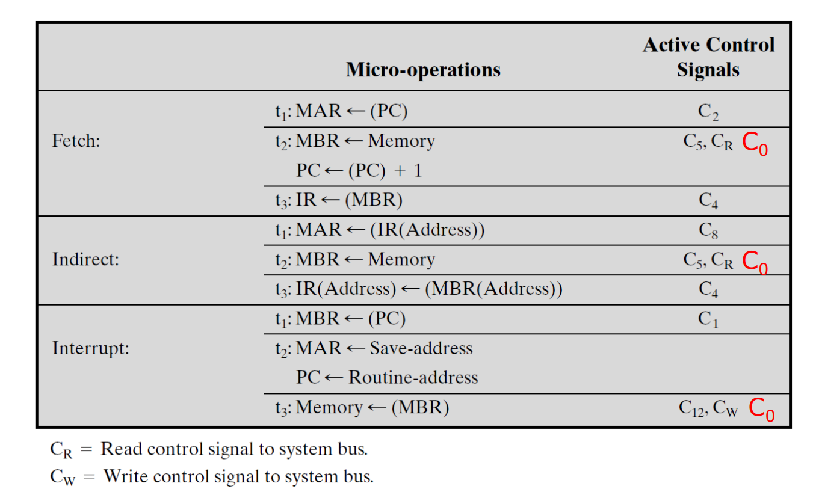
<center>  </center>  

### <center>Internal Processor Organization(内部总线结构):</center>


<!-- 

 -->
## 第二十一章 Microprogrammed Control

- [x] 已复习
  
### 21.1 BASIC CONCEPTS

<mark><big>microprogrammed control unit</big></mark>  is used in many CISC processors

Known as a <big>microprogramming language</big> . Each line describes a set of micro-operations occurring at one time and is known as a microinstruction . A sequence of instructions is known as a microprogram , on <big>firmware</big>.

> 翻译：<big>微程序设计语言</big>，每行描述一个时间内出现的一组微操作，并称呼为一条微指令，这种微指令序列被称为<big>微程序</big>或<big>固件</big>

Horizional microinstruction (水平微指令)，control word as follows:

one bit for each internal processor control line and one bit for each system bus control line . and a condition field indicating the condition under which there should be a branch, and there is a field with the address of the micro-instruction to be executed next when a branch is taken.interated as follows:

1. To execute this microinstruction , turn on all the control lines indicated by a 1bit ; leave off all control lines indicated by a 0 bit. The resulting control signals will cause one or more micro-operations to be performed.
2. If the condition indicated by the condition bits is false ,execute the next microinstruction in sequence.
3. If the condition indicated by the condition bits is true, the next microinstruction to be executed is indicated in the address field.

<mark>Horizonal Microinstruction</mark>


```
    • Each micro-instruction specifies many different 
    micro-operations to be performed in parallel
      —One bit for each internal processor control line
      —One bit for each system bus control line
      —A condition field
      —A field with the address to be executed next when a branch is taken
```


<mark>Vertical Microinstruction</mark>

```
    • Each micro-instruction specifies single (or few) 
    micro-operations to be performed
      —Function codes: translates by decoder into individual 
    control signals
      —A condition field
      —A field with the address to be executed next when a 
    branch is taken
```


### 21.1 Microprogrammed control unit
#### functions of the control unit
1. To execute an instruction, the sequencing logic unit issues a  READ command to the control memory.
2. The word whose address is specified in the control address register is read into the control buffer register.
3. The consist of the control buffer register generates control signals and next address imformation for the sequencing logic unit.
4. The sequencing logic unit loads a new address into the control address register based on the next address information from the control buffer register and the ALU flags.
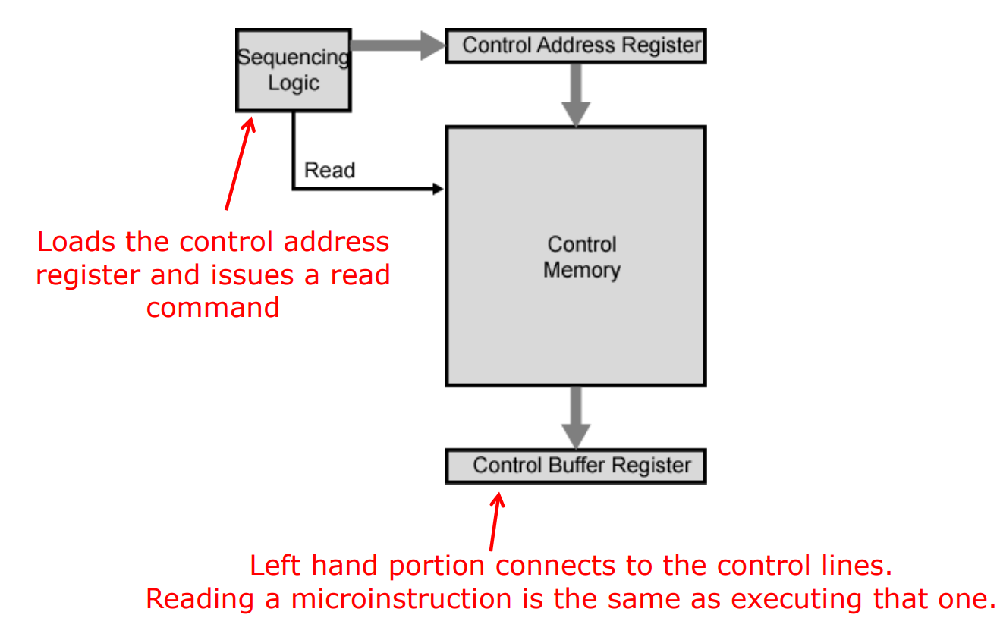
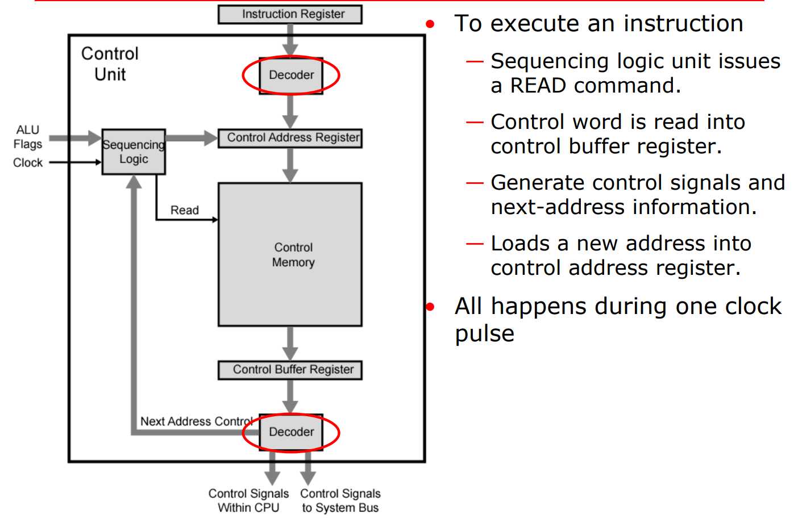
> the upper decoder translate the opcode of IR into a control memory address. The lower decoder is not used for horizonal microinstructions but for vertical instructions, to translate the code into individual control signals
### 21.2 MICROINSTRUCTION SEQUENCING

two basic tasks of a microprogrammed control unit:

1. <mark><big>Microinstruction sequence（微指令排序）</big></mark>:Get the next microinstruction from the control memory.
2. <mark><big>microprogrammed control unit（微指令执行）</big></mark>:Generage the control signals needed to execute the microinstruction.

<!-- <p style="text-align:center">居中对齐</p> -->
 

#### Address Generation
<mark>the address of the next microinstruction to be executed is in one of these catagories:</mark>

* Determined by instruction register(IR code) 
* Next sequential address
* Branch (address field in the microinstruction)

##### variable addressing

with two different microinstruction formats. one bit designates which format is being used.one format the remaining bits are used to activate control signals.In the other format.some bits drive the branch logic module,and the remaining bits provide the branch address.


<!-- 让表格居中显示的风格 -->
<style>
.center 
{
  width: auto;
  display: table;
  margin-left: auto;
  margin-right: auto;
}
</style>

$\color{blue}{地址生成(显式和隐式)}$

<div class="center">

|Explicit|Implicit|
|:--:|:--:|
|Two-field|Mapping|
|Unconditional branch|Addition|
|Conditional branch|Residual control|

</div>

<strong>Specific Encoding Techniques</strong>

* Microinstruction organized as set of fields
* Each field contains a code
* A code activates one or more control signals
* Encoded microinstruction format design(Functional encoding , Resaurce encoding)
* Direct/indirect encoding(Indirect: one field is used to determine the interpretation of another field)
